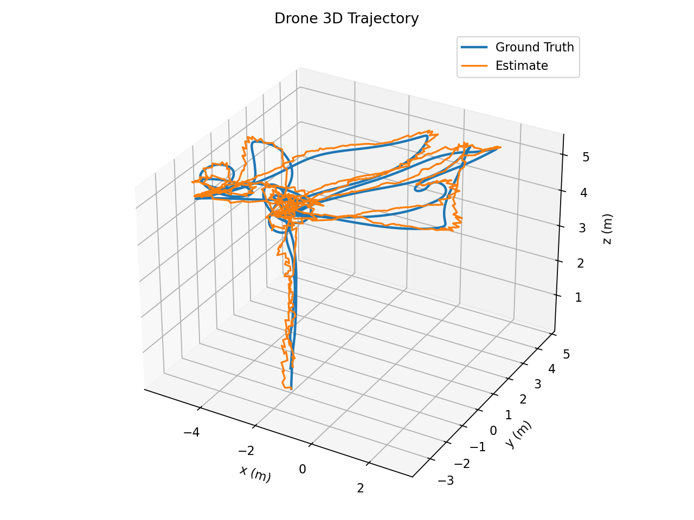
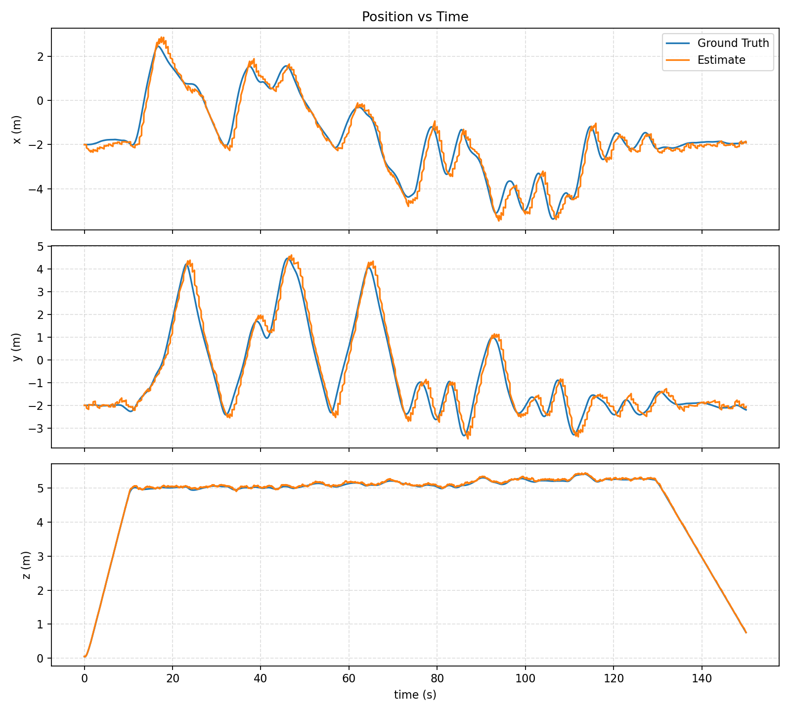
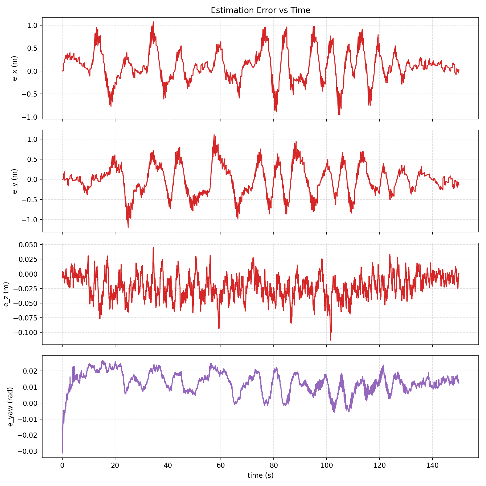

# EE4308 Project 2 Report Draft

Team number: `p2_team##`

Matric numbers:

- `A0XXXXXXX`
- `A0XXXXXXX`
- `A0XXXXXXX`

Note: keep only matric numbers in the final PDF. Do not include names.

## Abstract

This project implements the full drone stack required by EE4308 Project 2: a waypoint-based behavior node, a holonomic path-tracking controller, and a simplified Kalman filter estimator. Our main effort was spent on the estimator, because the baseline failure mode was not gross divergence but persistent planar lag and unreliable vertical correction under mixed sensors. We therefore kept the required project structure, but added several targeted improvements: sonar gating, barometer bias augmentation, Joseph-form covariance update, GPS-derived pseudo-velocity correction, and GPS forward compensation. The final baseline uses conservative tuning rather than the single best run. In the latest full-system check (`full_check_gui_03`), the aligned mean absolute errors were `0.262 m` in `x`, `0.288 m` in `y`, `0.024 m` in `z`, and `0.0128 rad` in yaw over `4501` aligned samples. The drone completed the required chase-return cycles and entered the landing stage before the fixed logging window ended.

## 1. Introduction

The project requires the drone to:

1. take off to an initial air position at `5.0 m`,
2. repeat the cycle `turtle position -> turtle current waypoint -> initial air position`,
3. finish the current cycle when the turtle stops,
4. land at the initial ground position.

The main technical challenge in our final system was not behavior logic. The state machine and holonomic controller were implemented early and were already sufficient to complete the nominal mission when driven by ground truth. The main bottleneck was state estimation quality, because controller performance is only as good as the estimated odometry. In particular:

- the `z` axis could be corrupted by unreliable sonar readings at higher altitude,
- the barometer had a persistent bias that was not explicitly modeled,
- the planar `x/y` estimate showed lag relative to the true motion,
- time lag in GPS messages made position correction less effective during faster motion.

Our report is therefore organized around the sequence:

`problem -> design change -> experiment -> final decision`.

## 2. System Overview

### 2.1 Behavior node

The behavior node implements the required finite-state machine in [`behavior.cpp`](../src/ee4308_drone/src/behavior.cpp). The states are:

- `TAKEOFF`
- `INITIAL`
- `TURTLE_POSITION`
- `TURTLE_WAYPOINT`
- `LANDING`
- `END`

The implementation continuously refreshes the waypoint during `TURTLE_POSITION`, so the drone actively chases the moving turtle instead of flying to an outdated position. Once a waypoint is reached, the node transitions according to the assignment logic. Importantly, when the turtle has already stopped, the system only lands after the current cycle returns to `INITIAL`, which matches the project requirement.

### 2.2 Controller node

The controller in [`controller.cpp`](../src/ee4308_drone/src/controller.cpp) is a holonomic pure-pursuit-style tracker. At each timer tick it:

1. finds the closest point on the current plan,
2. chooses the first downstream point whose distance is at least the lookahead distance,
3. applies proportional control to the lookahead point in world coordinates,
4. saturates horizontal and vertical velocity,
5. rotates the commanded horizontal velocity into the drone body frame,
6. publishes a constant yaw rate.

The translational control law is

$$
v_x^{world} = k_{p,xy}(x_L - x), \quad
v_y^{world} = k_{p,xy}(y_L - y), \quad
v_z = k_{p,z}(z_L - z),
$$

followed by saturation

$$
\sqrt{(v_x^{world})^2 + (v_y^{world})^2} \le 1.0,\quad |v_z| \le 0.5.
$$

The final controller parameters kept the assignment limits:

- `lookahead_distance = 1.0`
- `max_xy_vel = 1.0`
- `max_z_vel = 0.5`
- `yaw_vel = -0.3`

## 3. Estimator Design

### 3.1 State decomposition

The final estimator is axis-separated:

- `Xx = [x, vx]^T`
- `Xy = [y, vy]^T`
- `Xz = [z, vz, b_baro]^T`
- `Xa = [yaw, yaw_rate]^T`

We kept this structure because it matches the project handout, keeps the matrices small, and is sufficient for the sensor suite used in simulation. The only deliberate state augmentation is on the `z` axis, where the barometer bias is modeled explicitly.

### 3.2 Prediction model

For `x` and `y`, a constant-velocity model is driven by IMU acceleration transformed into the world frame using the current yaw estimate:

$$
\begin{aligned}
x_{k+1} &= x_k + v_{x,k}\Delta t + \frac{1}{2}a_x \Delta t^2, \\
v_{x,k+1} &= v_{x,k} + a_x \Delta t,
\end{aligned}
$$

with the same form for `y`.

For `z`, the model is

$$
\begin{aligned}
z_{k+1} &= z_k + v_{z,k}\Delta t + \frac{1}{2}a_z \Delta t^2, \\
v_{z,k+1} &= v_{z,k} + a_z \Delta t, \\
b_{baro,k+1} &= b_{baro,k}.
\end{aligned}
$$

For yaw, the estimator integrates angular velocity from the IMU:

$$
\psi_{k+1} = \psi_k + \omega_z \Delta t.
$$

### 3.3 Covariance update

Instead of the simpler covariance update often used in basic implementations, we use the Joseph form:

$$
P^+ = (I - KH)P^-(I - KH)^T + KRK^T.
$$

This is numerically safer and helped keep the covariance symmetric and well behaved during repeated mixed-sensor corrections.

### 3.4 Measurement models kept in the final baseline

GPS position:

$$
z_{gps,x} = x,\quad z_{gps,y} = y,\quad z_{gps,z} = z
$$

after converting from geodetic coordinates to ECEF, then to local NED, and finally to the Gazebo world frame.

Magnetometer:

$$
z_{mag} = \psi
$$

Sonar:

$$
z_{sonar} = z
$$

but only when the reading is considered trustworthy.

Barometer:

$$
z_{baro} = z + b_{baro}
$$

with observation matrix

$$
H_{baro} = [1\ \ 0\ \ 1].
$$

This barometer model is one of the most important improvements in the final estimator.

## 4. Main Improvements and Why They Were Needed

### 4.1 Sonar gating for the `z` axis

The baseline `z` estimator can be damaged by bad sonar readings when the drone is high above the ground or when the beam hits an unexpected surface. We therefore only accept sonar updates when:

- the predicted altitude is below a trust threshold, and
- the sonar innovation is not too large.

In the final code, the sonar update is accepted only when the predicted altitude is below `3.8 m` and the innovation magnitude is below `1.0 m`. This prevents obviously wrong high-altitude sonar measurements from collapsing the height estimate.

### 4.2 Barometer bias augmentation

The barometer was not just noisy; it also exhibited a systematic offset. Treating it as a direct measurement of `z` caused steady vertical bias. We instead augment the state with `b_baro`, which allows the filter to explain slow barometer offset explicitly rather than forcing the `z` estimate itself to absorb the error.

This change solved the actual modeling problem instead of only re-tuning `var_baro`.

### 4.3 GPS-derived pseudo-velocity correction

The planar `x/y` issue was mostly lag, not catastrophic drift. Since GPS is the only absolute position source in the horizontal plane, we derived a pseudo-velocity from consecutive GPS positions:

$$
\hat{v}_{gps} = \frac{p_{gps,k} - p_{gps,k-1}}{\Delta t},
$$

then filtered it using

$$
v_{f,k} = \alpha \hat{v}_{gps,k} + (1-\alpha)v_{f,k-1}.
$$

This pseudo-velocity is not treated as a strong measurement. Instead, it is used conservatively:

- only within a valid `\Delta t` range,
- with a lower-bounded variance,
- and only when the innovation is not too large.

The purpose is not to overwrite the state aggressively, but to reduce persistent planar lag.

### 4.4 GPS forward compensation

GPS corrections can be late relative to the most recent predicted state. If the filter corrects using an outdated position without compensation, the estimate remains behind the true trajectory during motion. We therefore forward-propagate the GPS position using the current estimated velocity when the timestamp lag is positive but limited:

$$
p_{gps}^{corr} = p_{gps} + \hat{v}\Delta t_{lag}.
$$

This is a simple latency compensation step and directly targets the time-alignment problem.

### 4.5 Improvements that were tested but not kept

We also tested soft gating for GPS, magnetometer, and barometer updates. The idea was to reject measurements whose innovation exceeded an absolute or covariance-scaled threshold. However, experiments showed that these gates often blocked useful corrections instead of only removing bad ones. Since the runtime benefit was not positive, this logic was removed from the final estimator and is discussed only as a rejected design in this report.

## 5. Experimental Methodology

### 5.1 Runtime configuration

The final runtime configuration is stored in [`proj2.yaml`](../src/ee4308_bringup/params/proj2.yaml). The most important estimator parameters are:

| Parameter | Final value |
| --- | ---: |
| `var_imu_x`, `var_imu_y` | `1.5` |
| `var_imu_z` | `20.0` |
| `var_imu_a` | `1.0` |
| `var_gps_x`, `var_gps_y` | `0.15` |
| `var_gps_z` | `0.5` |
| `var_baro` | `1.0` |
| `var_sonar` | `0.03` |
| `var_magnet` | `1.0` |
| `gps_forward_compensation_enable` | `true` |
| `gps_forward_compensation_max_dt` | `0.5` |
| `gps_velocity_alpha` | `0.9` |
| `gps_velocity_variance_scale` | `0.1` |
| `gps_velocity_min_variance` | `0.04` |
| `gps_velocity_max_innovation` | `1.5` |
| `gps_velocity_min_dt` | `0.2` |
| `gps_velocity_max_dt` | `2.0` |

### 5.2 Tools

We used the following scripts to run repeatable experiments:

- [`tools/run_proj2_param_sweep.py`](../tools/run_proj2_param_sweep.py) for short ablations and parameter sweeps,
- [`tools/run_proj2_full_check.py`](../tools/run_proj2_full_check.py) for full mission validation,
- [`tools/record_drone_alignment.py`](../tools/record_drone_alignment.py) to align estimated and true odometry,
- [`tools/record_drone_plan.py`](../tools/record_drone_plan.py) to log the commanded plan and verify state transitions.

### 5.3 Metrics

For short sweep experiments, we used the `aligned_score` produced by the sweep tooling, together with aligned-window MAE values. Lower `aligned_score` is better. For full mission validation, we report overall MAE and RMSE from the aligned estimator-vs-ground-truth trajectory.

## 6. Results

### 6.1 Full-system validation: `full_check_gui_03`

The latest full-system run is stored in [`tmp/proj2_runs/full_check_gui_03`](../tmp/proj2_runs/full_check_gui_03). It contains:

- aligned estimate/ground-truth logs,
- recorded plan commands,
- trajectory plots,
- error plots,
- summary statistics.

The run summary is:

| Metric | `x` | `y` | `z` | `yaw` |
| --- | ---: | ---: | ---: | ---: |
| MAE | `0.2616 m` | `0.2878 m` | `0.0241 m` | `0.0128 rad` |
| RMSE | `0.3404 m` | `0.3590 m` | `0.0296 m` | `0.0141 rad` |
| 95th percentile absolute error | `0.7170 m` | `0.6921 m` | `0.0547 m` | `0.0226 rad` |

These values show three things clearly:

- the vertical estimate is strong, with `z` error typically within a few centimeters,
- yaw estimation is very accurate and no longer a bottleneck,
- the remaining weakness is still the planar `x/y` error, especially during fast directional changes.

The logged plan confirms that the state machine completed the required cycle structure:

- `0.0-10.1 s`: takeoff to the initial air position,
- `10.1-31.2 s`: cycle 1,
- `31.2-55.7 s`: cycle 2,
- `55.7-85.4 s`: cycle 3,
- `85.4-129.7 s`: cycle 4,
- `129.7 s` onward: landing command issued.

This confirms that the integrated `behavior + controller + estimator` stack is functional, not only the estimator in isolation.

Figure 1. Full 3D trajectory for `full_check_gui_03`. The estimated path follows the true path closely, while the main visible mismatch remains in the horizontal plane during aggressive motion.

Figure 2. Position traces over time. The `z` estimate remains tightly aligned with the true altitude during takeoff, cruise, and the beginning of descent. The largest visible tracking mismatch is in `x/y`, consistent with a residual planar lag problem rather than vertical instability.

Figure 3. Error traces for the same full run. The yaw error remains very small, while `x` and `y` error oscillate with larger amplitude during rapid directional changes and corridor transitions.

Compared with the previous full check (`full_check_gui_02`), overall MAE improved in `x`, `y`, and yaw:

- `x`: `0.3033 -> 0.2616 m`
- `y`: `0.3497 -> 0.2878 m`
- `yaw`: `0.0186 -> 0.0128 rad`

The `z` MAE increased slightly from `0.0160 m` to `0.0241 m`, but still remained small enough to support stable cruise-height tracking.

### 6.2 Why the `z` axis solution was kept

The `z` axis was not solved by a single variance change. It improved only after combining:

- sonar gating,
- explicit barometer bias augmentation,
- stable covariance correction.

In the final full-system run, the 95th percentile absolute `z` error is only `0.0547 m`, which is much smaller than the horizontal error scale. This matches our qualitative observation from the trajectory and time-series plots: altitude is no longer the main failure mode.

### 6.3 Pseudo-velocity ablation

The results from [`tmp/proj2_param_sweeps/xy_logic_run2/summary.txt`](../tmp/proj2_param_sweeps/xy_logic_run2/summary.txt) are:

| Case | aligned score | aligned MAE `(x, y, z)` |
| --- | ---: | --- |
| `pseudo_default` | `0.628` | `(0.421, 0.149, 0.030)` |
| `pseudo_off` | `0.645` | `(0.437, 0.164, 0.023)` |
| `pseudo_stronger` | `0.903` | `(0.512, 0.353, 0.021)` |
| `pseudo_weaker` | `0.997` | `(0.363, 0.568, 0.036)` |

The conclusion is not that pseudo-velocity solves planar tracking completely. Instead, a conservative pseudo-velocity correction is slightly better than turning it off, while stronger or weaker variants both hurt performance. This is exactly the kind of result that matters in practice: a moderate correction helps, but over-trusting a derived signal makes the estimate worse.

### 6.4 Forward compensation ablation

The results from [`tmp/proj2_param_sweeps/forward_comp_compare2/summary.txt`](../tmp/proj2_param_sweeps/forward_comp_compare2/summary.txt) are:

| Case | aligned score | aligned MAE `(x, y, z)` |
| --- | ---: | --- |
| `fc_on_no_gate` | `0.559` | `(0.373, 0.131, 0.031)` |
| `fc_off_no_gate` | `0.864` | `(0.723, 0.077, 0.032)` |
| `fc_small_dt_no_gate` | `0.940` | `(0.550, 0.328, 0.036)` |

This experiment supports two final decisions:

- GPS forward compensation is worth keeping,
- a `0.5 s` compensation window works better than a tighter `0.2 s` window.

The main benefit is lower planar lag in motion segments where GPS corrections would otherwise arrive too late.

### 6.5 Parameter finalization around `var_gps_x/y`

The key parameter sweep in [`tmp/proj2_param_sweeps/vel_fix_run2/summary.txt`](../tmp/proj2_param_sweeps/vel_fix_run2/summary.txt) gave:

| Case | aligned score | aligned MAE `(x, y, z)` |
| --- | ---: | --- |
| `gps0p15_repeat` | `0.330` | `(0.230, 0.058, 0.020)` |
| `gps0p12` | `0.381` | `(0.235, 0.110, 0.019)` |
| `gps0p15_imu2p0` | `0.402` | `(0.196, 0.149, 0.029)` |
| `gps0p15_imu2p5` | `0.423` | `(0.281, 0.091, 0.026)` |
| `gps0p10` | `0.438` | `(0.199, 0.195, 0.021)` |
| `gps0p12_no_vel` | `0.480` | `(0.267, 0.168, 0.020)` |
| `gps0p15_no_vel` | `0.575` | `(0.393, 0.121, 0.028)` |

From this table we made two decisions:

- keep `var_gps_x = var_gps_y = 0.15`,
- keep pseudo-velocity correction enabled.

Lowering GPS variance further did not produce a robust overall improvement. Removing pseudo-velocity clearly degraded the planar estimate.

### 6.6 Stability matters more than a single best run

We explicitly checked run-to-run variation with repeated runs. The summary in [`tmp/proj2_param_sweeps/stability_check/summary.txt`](../tmp/proj2_param_sweeps/stability_check/summary.txt) shows:

| Case | aligned score |
| --- | ---: |
| `gps0p15_r1` | `0.378` |
| `gps0p15_r2` | `0.588` |
| `gps0p15_r3` | `0.691` |

The standard deviation across these repeats is about `0.130`, which is large enough that choosing parameters from only one run would be misleading.

We then compared `var_imu_x = var_imu_y` across repeated runs using [`tmp/proj2_param_sweeps/imu_sweep_b/summary.txt`](../tmp/proj2_param_sweeps/imu_sweep_b/summary.txt):

| IMU variance | scores | median | population std |
| --- | --- | ---: | ---: |
| `1.5` | `0.477, 0.473, 0.485` | `0.477` | `0.005` |
| `2.0` | `0.548, 0.472, 0.623` | `0.548` | `0.062` |
| `3.0` | `0.352, 0.510, 0.477` | `0.477` | `0.068` |

Although `3.0` produced one very good run, its variability was much larger. We therefore selected `1.5` because its median performance was competitive while its repeatability was much better.

### 6.7 Rejected soft-gating design

The results from [`tmp/proj2_param_sweeps/gating_compare1/summary.txt`](../tmp/proj2_param_sweeps/gating_compare1/summary.txt) are:

| Case | aligned score | aligned MAE `(x, y, z)` |
| --- | ---: | --- |
| `gating_off` | `0.634` | `(0.491, 0.101, 0.020)` |
| `gating_default` | `0.750` | `(0.470, 0.233, 0.023)` |
| `gating_tighter` | `2.413` | `(1.975, 0.392, 0.020)` |

This is a useful negative result. The gate did not improve the estimator and tighter gates were clearly harmful. The likely reason is that the gate rejected many valid updates instead of only true outliers. We therefore removed this logic from the final runtime code and only keep it in the report as a documented failed attempt.

## 7. Discussion

### 7.1 What improved the system most

The most important lesson from this project is that the best improvements came from correcting the sensor model rather than endlessly sweeping variances:

- `z` improved because sonar was gated and barometer bias was modeled explicitly,
- `x/y` improved because planar lag was attacked structurally with pseudo-velocity and timestamp compensation,
- covariance handling improved because the correction step became numerically safer.

### 7.2 Remaining limitation

The remaining weakness is planar error during aggressive horizontal motion. The final estimate is usable and much better than the original baseline, but it still exhibits oscillatory `x/y` error during fast transitions. This is consistent with the fact that GPS is a low-rate, delayed position source. Our pseudo-velocity and forward-compensation logic reduce the lag, but cannot completely remove the information limit imposed by the sensor set.

### 7.3 Practical advice

If this system were deployed in a more realistic setting, we would recommend:

- keeping the conservative pseudo-velocity correction rather than increasing its strength,
- keeping forward compensation enabled,
- avoiding over-tight innovation gates unless the sensor outlier model is much better understood,
- evaluating all future tuning choices with repeated runs instead of one best trial.

## 8. Conclusion

The final project implementation satisfies the required behavior, controller, and estimator functionality of Project 2. The strongest contributions are in the estimator:

- sonar gating prevents bad high-altitude sonar updates,
- barometer bias augmentation fixes the vertical model mismatch,
- Joseph-form correction improves numerical robustness,
- GPS pseudo-velocity reduces planar lag,
- GPS forward compensation improves time alignment during correction.

These choices were not selected from intuition alone. Each retained feature was supported by targeted experiments, and each rejected feature was removed because the data did not justify keeping it. The latest full-system validation shows accurate altitude and yaw estimation, acceptable planar tracking, and successful end-to-end mission execution with the required cycle logic.

## 9. Contribution Statement

Replace this section with the actual team contribution page required by the handout. Keep it factual and specific. One possible format is:

- `A0XXXXXXX`: behavior node implementation, plan logging, final full-system validation
- `A0XXXXXXX`: controller tuning, plotting scripts, report figures and discussion
- `A0XXXXXXX`: estimator design, parameter sweeps, ablation experiments, final estimator write-up

## Appendix A. Recommended Figure and Table Placement

If this markdown draft is converted into the final PDF, the following items should definitely be retained:

- Figure 1: final 3D trajectory
- Figure 2: position vs time
- Figure 3: estimation error vs time
- Table for forward-compensation ablation
- Table for pseudo-velocity ablation
- Table for final parameter selection around `var_gps_x/y`
- Table for repeated-run stability and IMU variance comparison
