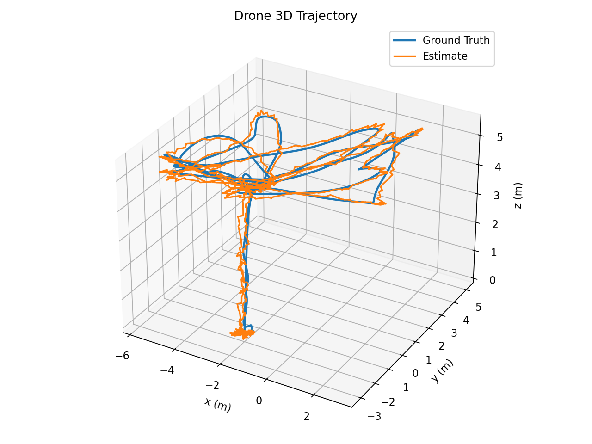
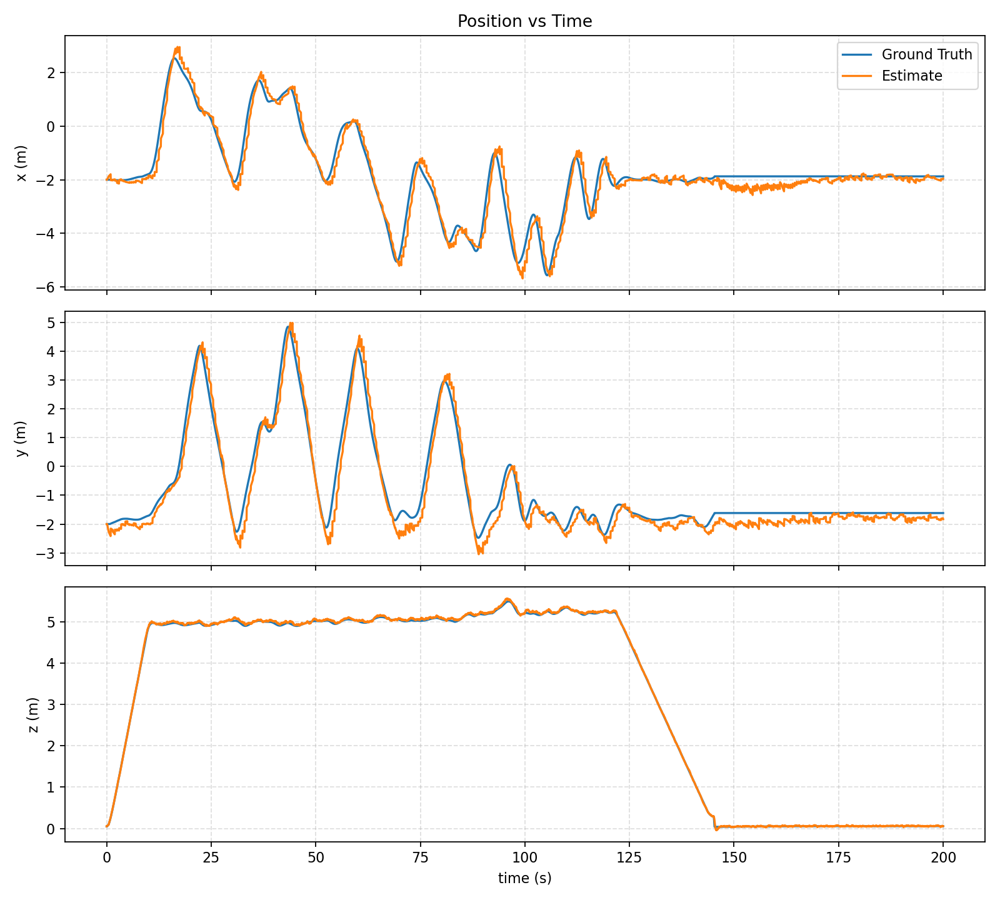
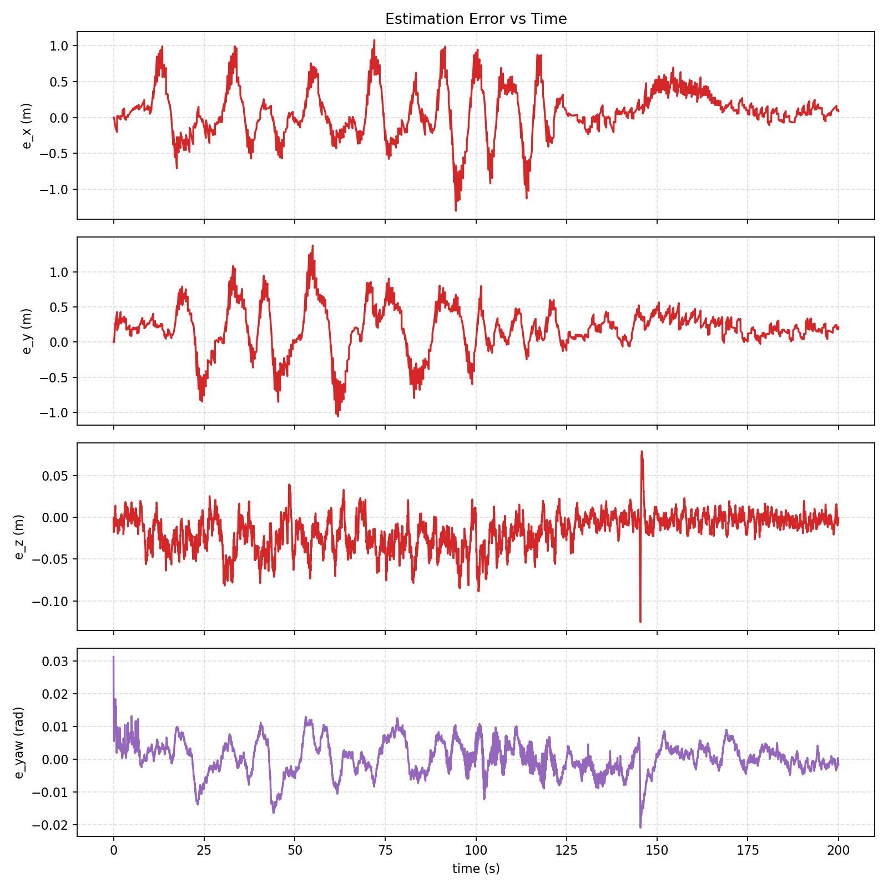

# EE4308 Project 2 Estimator Report Draft

Team number: `p2_team##`

Matric numbers:

- `A0XXXXXXX`
- `A0XXXXXXX`
- `A0XXXXXXX`

Note: keep only matric numbers in the final PDF. Do not include names.

## Abstract

This report focuses only on our Project 2 estimator contribution. The behavior and controller were implemented by teammates, so they are used here only as part of the full-system validation environment, not as report content. Our main estimator problems were: unreliable `z` correction when sonar was used outside its trustworthy range, persistent barometer bias, planar `x/y` lag, and GPS timing mismatch. We kept the handout's simplified per-axis Kalman filter structure, but added five targeted improvements: sonar gating, barometer bias augmentation, Joseph-form covariance update, GPS-derived pseudo-velocity correction, and GPS forward compensation. The final parameter set was chosen from ablations and repeated runs rather than from a single best result. In the final full-mission validation run [`full_check_gui_04`](../tmp/proj2_runs/full_check_gui_04), the aligned mean absolute errors were `0.2538 m` in `x`, `0.3013 m` in `y`, `0.0196 m` in `z`, and `0.00394 rad` in yaw over `5992` aligned samples. The drone entered landing at about `121.7 s`, touched down at about `145.3 s`, and remained stably on the ground for the rest of the `200 s` run.

## 1. Scope and Focus

According to the Project 2 handout [`proj2.md`](../docs/proj2.md), the estimator must implement:

- IMU prediction,
- GPS correction,
- magnetometer correction,
- sonar correction,
- barometer correction,
- geodetic-to-local coordinate conversion.

This draft only covers that estimator work. The full project still uses the integrated drone stack during experiments, because the estimator must be tested under realistic motion generated by the actual mission. However, the report narrative below is restricted to:

- what the baseline estimator was doing,
- why it failed,
- what changes were kept,
- what was tried and rejected,
- how the final parameters were chosen,
- how the final estimator behaved in a complete mission run.

This structure matches the teaching preference stated in [`email.md`](../docs/email.md): explain why and how each change improves the system, support tuning with deliberate experiments, and include failed attempts when they are informative.

## 2. Baseline Estimator and Failure Analysis

### 2.1 Baseline structure

We retained the handout's simplified per-axis Kalman filter idea and only extended it where necessary. The final state decomposition is:

- `Xx = [x, vx]^T`
- `Xy = [y, vy]^T`
- `Xz = [z, vz, b_baro]^T`
- `Xa = [yaw, yaw_rate]^T`

The important point is that this was not a full 3D coupled EKF. It remained a small, axis-separated filter, because the project sensor set is naturally separable and the assignment itself is designed around that simplification.

### 2.2 What went wrong in the early runs

The first serious estimator problem was the `z` axis. Early runs showed that the baseline was not just noisy but structurally wrong:

- sonar could become unreliable at higher altitude,
- barometer readings contained a persistent bias,
- simple variance tuning alone could improve one time window while still failing later.

This can be seen in the early sweep [`tmp/proj2_param_sweeps/run1/summary.txt`](../tmp/proj2_param_sweeps/run1/summary.txt):

| Case | aligned score | aligned MAE `(x, y, z)` | aligned `w7_25` `mae_z` |
| --- | ---: | --- | ---: |
| `current` | `2.077` | `(0.538, 0.506, 0.499)` | `0.533` |
| `gps_z_0p3` | `0.934` | `(0.433, 0.311, 0.017)` | `0.173` |
| `baro_1p5` | `1.165` | `(0.458, 0.277, 0.014)` | `0.416` |
| `imu_z_10` | `1.813` | `(0.480, 0.518, 0.325)` | `0.490` |

The lesson from this table is important: plain noise retuning could change the outcome, but it did not robustly solve the height problem. Even the better early cases still had large `z` error in later windows. This is why we moved from "retune the variances" to "fix the sensor model."

The second problem was planar lag. The horizontal estimate generally followed the trajectory shape, but it stayed behind the true motion, especially during faster turns and directional reversals. This mattered because the controller only sees `odom`, so even a stable but lagging estimate causes delayed path tracking.

The third problem was update timing. GPS corrections arrived with nonzero lag relative to the latest predicted state. Correcting the state using an outdated GPS position naturally leaves the estimate behind the current motion.

## 3. Final Estimator Design

### 3.1 Prediction model

For `x` and `y`, we use a constant-velocity model driven by IMU acceleration transformed into the world frame:

$$
\begin{aligned}
x_{k+1} &= x_k + v_{x,k}\Delta t + \frac{1}{2} a_x \Delta t^2, \\
v_{x,k+1} &= v_{x,k} + a_x \Delta t,
\end{aligned}
$$

and similarly for `y`.

For `z`, the final model is:

$$
\begin{aligned}
z_{k+1} &= z_k + v_{z,k}\Delta t + \frac{1}{2} a_z \Delta t^2, \\
v_{z,k+1} &= v_{z,k} + a_z \Delta t, \\
b_{baro,k+1} &= b_{baro,k}.
\end{aligned}
$$

For yaw:

$$
\psi_{k+1} = \psi_k + \omega_z \Delta t.
$$

The key modeling change is the extra barometer-bias state `b_baro`. Without it, the barometer offset has nowhere physically meaningful to go except into the `z` estimate itself.

### 3.2 Joseph-form covariance correction

For all retained correction steps, we update covariance using the Joseph form

$$
P^+ = (I - KH)P^-(I - KH)^T + KRK^T.
$$

This is numerically safer than the naive covariance update and reduces the risk of losing symmetry or creating unrealistic covariance after repeated asynchronous measurement updates.

### 3.3 Retained correction models

GPS position correction:

$$
z_{gps,x} = x, \quad z_{gps,y} = y, \quad z_{gps,z} = z
$$

after converting latitude, longitude, altitude to ECEF, then local NED, then the Gazebo world frame.

Magnetometer:

$$
z_{mag} = \psi
$$

Sonar:

$$
z_{sonar} = z
$$

Barometer:

$$
z_{baro} = z + b_{baro}, \qquad H_{baro} = [1\ \ 0\ \ 1].
$$

### 3.4 Sonar gating

The sonar update is only accepted when:

- the predicted altitude is low enough to trust the sensor,
- the sonar innovation is not too large.

In the final code this means:

- predicted `z <= 3.8 m`,
- `|innovation| <= 1.0 m`.

This targets the actual failure mode: the sonar is useful near the ground, but it should not be allowed to override the height estimate when the drone is already high above the floor or when the measurement is obviously inconsistent.

### 3.5 Barometer bias augmentation

The barometer was useful, but only after we stopped pretending it measured altitude directly. The final estimator models the barometer as altitude plus a slowly varying bias. This lets the filter explain systematic offset explicitly, which is why the final `z` axis is much more reliable than what we achieved by noise retuning alone.

### 3.6 GPS-derived pseudo-velocity

The planar issue was mainly lag, so we estimated a horizontal pseudo-velocity from consecutive GPS positions:

$$
\hat{v}_{gps,k} = \frac{p_{gps,k} - p_{gps,k-1}}{\Delta t}.
$$

We then filtered it with:

$$
v_{f,k} = \alpha \hat{v}_{gps,k} + (1-\alpha) v_{f,k-1}.
$$

This pseudo-velocity is not used aggressively. The correction is kept conservative by:

- requiring `\Delta t` to lie in a valid range,
- lower-bounding the measurement variance,
- rejecting the update when the velocity innovation is too large.

The goal is not to replace the filter's own velocity state, but to nudge it toward more realistic planar motion and reduce lag.

### 3.7 GPS forward compensation

If a GPS message is older than the latest predicted state, then directly correcting with the raw GPS position introduces a time mismatch. We therefore forward-compensate the GPS measurement using the current estimated velocity:

$$
p_{gps}^{corr} = p_{gps} + \hat{v}\Delta t_{lag}.
$$

This is simple, but it directly attacks the reason why the correction was late.

## 4. Experimental Methodology

### 4.1 Philosophy

We did not use a single giant parameter sweep. Instead, the experiments were organized around one question at a time:

1. Is the problem really noise magnitude, or is it the sensor model?
2. Does a proposed feature help when everything else is held fixed?
3. Is the improvement repeatable, or only a lucky run?

This matters because the instructor explicitly prefers deliberate tuning with explanation over "we tried many values and kept the best one."

### 4.2 Tooling

The main tools used were:

- [`tools/run_proj2_param_sweep.py`](../tools/run_proj2_param_sweep.py)
- [`tools/run_proj2_full_check.py`](../tools/run_proj2_full_check.py)
- [`tools/record_drone_alignment.py`](../tools/record_drone_alignment.py)
- [`tools/record_drone_plan.py`](../tools/record_drone_plan.py)

For short comparisons we used `aligned_score` and aligned-window MAE values from the sweep tooling. For the final validation run we used full-trajectory MAE and RMSE between estimated and ground-truth odometry.

### 4.3 Final runtime parameters

The final estimator parameters in [`proj2.yaml`](../src/ee4308_bringup/params/proj2.yaml) are:

| Parameter | Final value |
| --- | ---: |
| `var_imu_x`, `var_imu_y` | `1.5` |
| `var_imu_z` | `20.0` |
| `var_imu_a` | `1.0` |
| `var_gps_x`, `var_gps_y` | `0.15` |
| `var_gps_z` | `0.5` |
| `var_baro` | `1.0` |
| `var_sonar` | `0.03` |
| `var_magnet` | `1.0` |
| `gps_forward_compensation_enable` | `true` |
| `gps_forward_compensation_max_dt` | `0.5` |
| `gps_velocity_alpha` | `0.9` |
| `gps_velocity_variance_scale` | `0.1` |
| `gps_velocity_min_variance` | `0.04` |
| `gps_velocity_max_innovation` | `1.5` |
| `gps_velocity_min_dt` | `0.2` |
| `gps_velocity_max_dt` | `2.0` |

## 5. Results and Decisions

### 5.1 Pseudo-velocity ablation

The summary in [`tmp/proj2_param_sweeps/xy_logic_run2/summary.txt`](../tmp/proj2_param_sweeps/xy_logic_run2/summary.txt) is:

| Case | aligned score | aligned MAE `(x, y, z)` |
| --- | ---: | --- |
| `pseudo_default` | `0.628` | `(0.421, 0.149, 0.030)` |
| `pseudo_off` | `0.645` | `(0.437, 0.164, 0.023)` |
| `pseudo_stronger` | `0.903` | `(0.512, 0.353, 0.021)` |
| `pseudo_weaker` | `0.997` | `(0.363, 0.568, 0.036)` |

Interpretation:

- a conservative pseudo-velocity correction is slightly better than disabling it,
- stronger or weaker variants both make the estimate worse,
- this supports the claim that the pseudo-velocity should only be a light correction, not a dominant measurement.

### 5.2 Soft-gating rejection

The summary in [`tmp/proj2_param_sweeps/gating_compare1/summary.txt`](../tmp/proj2_param_sweeps/gating_compare1/summary.txt) is:

| Case | aligned score | aligned MAE `(x, y, z)` |
| --- | ---: | --- |
| `gating_off` | `0.634` | `(0.491, 0.101, 0.020)` |
| `gating_default` | `0.750` | `(0.470, 0.233, 0.023)` |
| `gating_tighter` | `2.413` | `(1.975, 0.392, 0.020)` |

This is a useful negative result. The gating logic did not improve the estimator, and tighter gates were clearly destructive. The most likely reason is that the gate rejected too many valid corrections instead of only removing real outliers. Because the runtime benefit was negative, this logic was removed from the final estimator and is mentioned only as a failed attempt.

### 5.3 Forward-compensation ablation

The summary in [`tmp/proj2_param_sweeps/forward_comp_compare2/summary.txt`](../tmp/proj2_param_sweeps/forward_comp_compare2/summary.txt) is:

| Case | aligned score | aligned MAE `(x, y, z)` |
| --- | ---: | --- |
| `fc_on_no_gate` | `0.559` | `(0.373, 0.131, 0.031)` |
| `fc_off_no_gate` | `0.864` | `(0.723, 0.077, 0.032)` |
| `fc_small_dt_no_gate` | `0.940` | `(0.550, 0.328, 0.036)` |

This supports two final decisions:

- keep GPS forward compensation enabled,
- keep the compensation window at `0.5 s`, not `0.2 s`.

The reason is straightforward: if the measurement is slightly old, correcting at the old position is the wrong thing to do during motion.

### 5.4 Final planar-parameter sweep

The main sweep for `var_gps_x/y` and pseudo-velocity logic is [`tmp/proj2_param_sweeps/vel_fix_run2/summary.txt`](../tmp/proj2_param_sweeps/vel_fix_run2/summary.txt):

| Case | aligned score | aligned MAE `(x, y, z)` |
| --- | ---: | --- |
| `gps0p15_repeat` | `0.330` | `(0.230, 0.058, 0.020)` |
| `gps0p12` | `0.381` | `(0.235, 0.110, 0.019)` |
| `gps0p15_imu2p0` | `0.402` | `(0.196, 0.149, 0.029)` |
| `gps0p15_imu2p5` | `0.423` | `(0.281, 0.091, 0.026)` |
| `gps0p10` | `0.438` | `(0.199, 0.195, 0.021)` |
| `gps0p12_no_vel` | `0.480` | `(0.267, 0.168, 0.020)` |
| `gps0p15_no_vel` | `0.575` | `(0.393, 0.121, 0.028)` |

The final choice was:

- `var_gps_x = var_gps_y = 0.15`
- keep pseudo-velocity enabled

Lower GPS variance could improve one axis in one run, but the overall result was not as robust.

### 5.5 Repeatability matters

The repeated-run check in [`tmp/proj2_param_sweeps/stability_check/summary.txt`](../tmp/proj2_param_sweeps/stability_check/summary.txt) shows:

| Case | aligned score |
| --- | ---: |
| `gps0p15_r1` | `0.378` |
| `gps0p15_r2` | `0.588` |
| `gps0p15_r3` | `0.691` |

The spread is large enough that choosing parameters from one lucky run would be bad experimental practice.

We therefore compared `var_imu_x = var_imu_y` using repeated runs in [`tmp/proj2_param_sweeps/imu_sweep_b/summary.txt`](../tmp/proj2_param_sweeps/imu_sweep_b/summary.txt):

| IMU variance | scores | median | population std |
| --- | --- | ---: | ---: |
| `1.5` | `0.477, 0.473, 0.485` | `0.477` | `0.005` |
| `2.0` | `0.548, 0.472, 0.623` | `0.548` | `0.062` |
| `3.0` | `0.352, 0.510, 0.477` | `0.477` | `0.068` |

This is exactly the kind of result the report should emphasize. `3.0` produced one very good run, but its variability was much larger. `1.5` had similar median quality and much better repeatability, so it was the more defensible final choice.

## 6. Final Full-Mission Validation

### 6.1 Why `full_check_gui_04` is the final baseline run

The earlier run [`full_check_gui_03`](../tmp/proj2_runs/full_check_gui_03) was useful, but it only logged `150 s` and stopped while the vehicle was still descending. The new run [`full_check_gui_04`](../tmp/proj2_runs/full_check_gui_04) lasts `200 s`, covers the full landing, and keeps recording after touchdown. This makes it more suitable as the final end-to-end evidence.

One important caveat: the `gui_04` averages are not directly comparable with `gui_03` on a one-number basis, because `gui_04` includes a long post-touchdown rest period. We therefore use `gui_04` mainly to show complete mission execution and post-landing estimator stability, not to claim an unfair like-for-like numerical win.

### 6.2 Overall metrics

From [`tmp/proj2_runs/full_check_gui_04/plots/summary.txt`](../tmp/proj2_runs/full_check_gui_04/plots/summary.txt):

| Metric | `x` | `y` | `z` | `yaw` |
| --- | ---: | ---: | ---: | ---: |
| MAE | `0.2538 m` | `0.3013 m` | `0.0196 m` | `0.00394 rad` |
| RMSE | `0.3380 m` | `0.3725 m` | `0.0263 m` | `0.00502 rad` |
| 95th percentile absolute error | `0.7176 m` | `0.7243 m` | `0.0544 m` | `0.0100 rad` |

The main conclusion is unchanged:

- `z` and yaw are now strong,
- planar `x/y` remains the dominant residual weakness,
- the estimator is good enough to support full-task completion.

### 6.3 Landing completion and post-touchdown stability

The plan log [`tmp/proj2_runs/full_check_gui_04/drone_plan.csv`](../tmp/proj2_runs/full_check_gui_04/drone_plan.csv) shows that the landing goal `(-2.0, -2.0, 0.05)` is active from about `121.7 s` to `145.8 s`. The aligned true trajectory shows:

- true `z <= 0.10 m` at about `145.3 s`,
- estimated `z <= 0.10 m` at about `145.4 s`.

After touchdown, the estimator remains stable for the rest of the run:

| Window | `x` MAE | `y` MAE | `z` MAE | `yaw` MAE |
| --- | ---: | ---: | ---: | ---: |
| touchdown to end (`145.5-200 s`) | `0.2022 m` | `0.2294 m` | `0.0078 m` | `0.00269 rad` |
| last `20 s` (`180-200 s`) | `0.0816 m` | `0.1694 m` | `0.0062 m` | `0.00171 rad` |

This is useful evidence because it shows that the estimator does not collapse after landing. The remaining steady-state issue is mostly a moderate planar offset, not vertical drift or yaw error.

Figure 1. Full 3D trajectory for `full_check_gui_04`. The full takeoff, cruise, and landing profile is now visible, including the post-touchdown ground segment.

Figure 2. Position traces over time. The estimator tracks the full mission and remains close to ground truth during descent and after touchdown. The most noticeable mismatch remains the horizontal offset in `x/y`.

Figure 3. Error traces for the final run. `z` and yaw stay tightly bounded, while the larger residual oscillations are clearly concentrated in the planar axes.

## 7. Discussion

### 7.1 What actually solved the problems

The most important lesson from this project is that the best gains did not come from endless parameter search alone.

- The `z` axis improved because the sensor model became more realistic: sonar was gated and barometer bias was modeled explicitly.
- The planar estimate improved because we attacked lag structurally: GPS pseudo-velocity and timestamp compensation address the reason the estimate was behind.
- The covariance update became safer because we used the Joseph form instead of the simpler but more fragile alternative.

These are the changes worth emphasizing in the report, because they explain why the estimator behaves better, not just that its numbers changed.

### 7.2 What did not work

Soft gating for GPS, magnetometer, and barometer updates was implemented and tested, but it did not help. This is worth including in the report because it shows that we did not simply keep every extra feature. We tried it, measured it, and removed it when it clearly blocked useful corrections.

### 7.3 Remaining limitation

The remaining limitation is planar accuracy. The final estimator is stable and good enough for the task, but it still shows larger `x/y` error than `z` or yaw, especially during aggressive horizontal motion and trajectory reversals. Even after landing, the residual error is mostly a horizontal offset rather than a vertical or heading problem.

## 8. Conclusion

The final estimator keeps the simplified Kalman-filter structure required by Project 2 but adds a small set of targeted improvements that directly address the observed failure modes:

- sonar gating,
- barometer bias augmentation,
- Joseph-form covariance correction,
- GPS pseudo-velocity correction,
- GPS forward compensation.

The evidence chain is consistent with the instructor's stated preference:

- each retained feature is justified by a specific problem,
- each major parameter choice is supported by ablation or repeated-run experiments,
- failed ideas are documented instead of hidden,
- the final claim is supported by a complete end-to-end run rather than only short windows.

The final `full_check_gui_04` run shows that the estimator supports full mission completion, complete landing, and stable post-touchdown behavior. The main residual weakness is still planar error, but the `z` axis and yaw are no longer major bottlenecks.

## 9. Contribution Page Placeholder

Replace this section with the actual contribution statement required in the final submission. Since this draft is estimator-focused, a concise contribution page could look like:

- `A0XXXXXXX`: estimator design, implementation, and tuning
- `A0XXXXXXX`: experiment scripts, data logging, plotting, and result analysis
- `A0XXXXXXX`: integrated testing and final report writing
